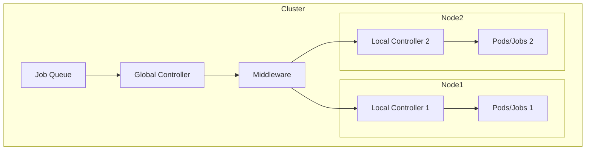
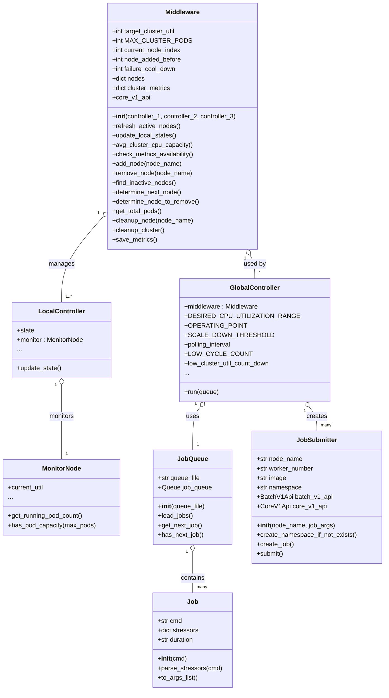

# Kubernetes Job Orchestrator

This project was developed as part of a Cloud System Management (Software Defined Systems) class.

It implements custom controllers for Kubernetes to automatically scale resources and assign pods for running stress jobs on a cluster. The architecture includes local controllers for each node, middleware for coordination, a global controller for cluster-wide scaling, and a job queue for managing stress jobs.

## What We Did

- Designed and implemented a custom Kubernetes control plane for stress job management.
- Developed a job queue system that holds incoming stress jobs.
- Built local controllers for each node to monitor workloads and report status.
- Created middleware to coordinate between local and global controllers.
- Implemented a global controller to manage scaling and job assignments across the cluster.
- Integrated pod assignment and dynamic scaling logic tailored for stress testing scenarios.

## What We Learned

- Practical application of Kubernetes internals and custom controller design.
- Communication mechanisms between distributed system components.
- Creating middleware for dynamic resource allocation and job scheduling in cloud environments.
- Real-world challenges of horizontal scaling, workload distribution, and monitoring.


## High-Level Architecture




## UML



**Entities:**
- **LocalController**: Manages a node, monitors CPU, and decides pod scaling.
- **MonitorNode**: Fetches node metrics (like CPU usage).
- **GlobalController**: Top-level manager for job assignment and scaling.
- **Middleware**: Handles communication between global and local controllers.
- **JobQueue**: Stores pending jobs.
- **Job**: Represents a workload or stress job.


## Usage

1. Clone the repository:
   ```bash
   git clone https://github.com/nitingoyal0996/Custom-Kubernetes-Controller.git
   cd Custom-Kubernetes-Controller
   ```
2. Set up the environment:
   ```bash
   cd scripts/setup
   bash install.sh
   ```
3. Start the master and worker nodes:
   ```bash
   bash scripts/setup/start_master.sh
   bash scripts/setup/start_worker.sh
   ```
4. Launch the main controller:
   ```bash
   python main.py
   ```
5. Define stress jobs in `static/jobs.txt`. The system will manage scaling and assignment automatically.

